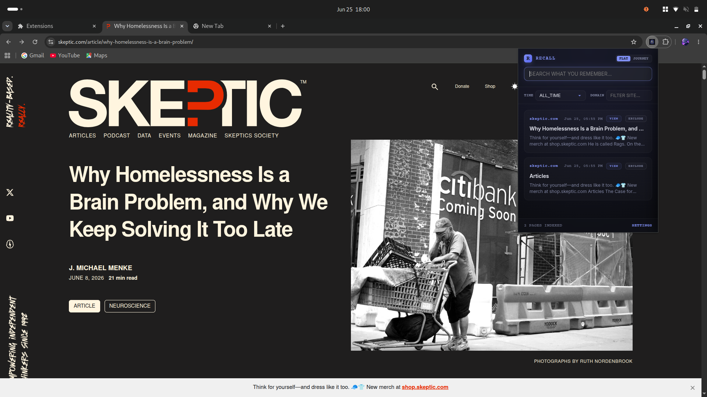

# Recall

**Search what you actually read, not just what you bookmarked.**

---

You visited a page three days ago. You remember roughly what it said, but not the title, not the URL, not the site. Standard browser history is useless here — it only stores titles and URLs, which are often meaningless. Recall runs quietly in the background and indexes the actual body text of every page you visit, locally, so you can search it later by what the page said.

Zero cloud. Zero accounts. Under a strict Content Security Policy that blocks all outbound network connections.

---

## Install

1. Download or clone this repo
2. Open `chrome://extensions` → enable **Developer Mode** (top right)
3. Click **Load unpacked** → select the `recall` folder (the one with `manifest.json`)

Recall starts indexing automatically after install.

---

## Searching

Open the popup and type. Recall runs a fuzzy full-text search with prefix matching across every indexed page's title, domain, and body content. Title matches are weighted 2.5×, domain matches 1.8×, body text 1×.

Results show the page title, domain, timestamp, and a highlighted snippet of matching text with the query terms wrapped in context.

**Filters**

- **Time** — narrow results to today, this week, this month, or all time
- **Domain** — filter to a specific site by typing a domain substring

**View modes**

- **Flat list** — results ranked by relevance score
- **Journey mode** — groups results by domain and time proximity (pages from the same domain visited within 30 minutes are clustered together), sorted by most recent

**Offline reader**

Click **VIEW** on any result to open the offline excerpt viewer — a slide-in panel that shows the cached text of the page, with your search terms highlighted throughout. Useful when the original page has changed or gone offline.

**Omnibox integration**

Type `rc ` in the Chrome address bar, then your query. Recall returns the top 5 matching pages as inline suggestions with title, domain, and URL. Select one to navigate directly.

---

## Features

**Indexing pipeline**
- Hooks into `chrome.webNavigation.onCompleted` to extract pages passively after they fully load
- Content script strips headers, footers, nav, scripts, styles, and password/login pages — body text only
- Deduplication: if the page content and title are identical to a previous visit within 12 hours, it skips the write to avoid unnecessary disk I/O; if content changed, it updates the record
- All data stored in IndexedDB with URL as primary key, with timestamp and domain indexes

**Privacy controls**
- Default blocklist covers search engines, social media, and localhost — configurable in options
- **Exclude domain** button on every result card: two-click confirmation, then the domain is blocklisted and all its stored records are deleted immediately
- Options dashboard shows total pages indexed, estimated disk usage, retention period setting, blocklist editor, and a full data wipe button

**Retention**
- Configurable retention period (default: 30 days)
- Daily alarm triggers automatic purge of pages older than the retention cutoff

**Security**
- Runs under a strict CSP with `connect-src 'none'` — the extension is physically incapable of making outbound network requests

---

## Stack

`Vanilla JS` · `Manifest V3` · `MiniSearch.js` · `IndexedDB` · `Chrome WebNavigation API` · `Chrome Omnibox API` · `Chrome Storage API`

---

## License

MIT
